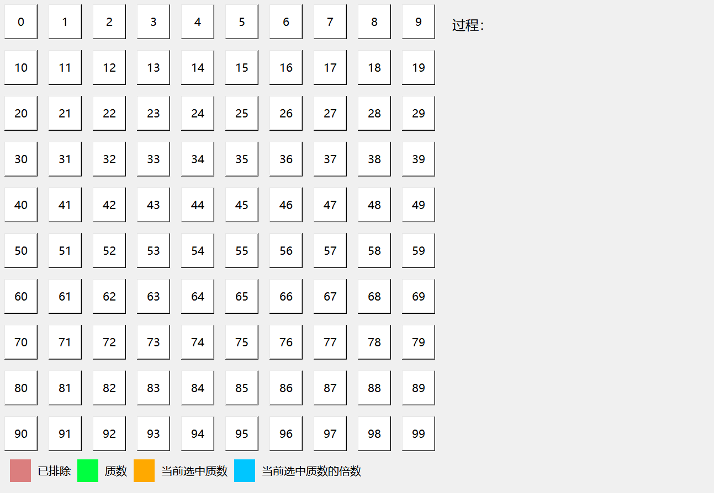

## [LeetCode 412.Fizz Buzz](https://leetcode-cn.com/problems/count-primes/)
### 描述

统计所有小于非负整数 n 的质数的数量。
```
示例:

输入: 10
输出: 4
解释: 小于 10 的质数一共有 4 个, 它们是 2, 3, 5, 7 。
```

质数(素数): 即除了1与自身之外 无其他因数
#### 解一 [暴力解法]
**思路**

对根号n以下的数字分别取模 只要有余数为0 的即不是质数


**代码**
```Javascript 
var countPrimes1 = function(n) {
    let count = 0;
    for(let i = 2; i < n; i++) {
        let flag = true;
        for(let j = 2; j*j <= i; j++){ 
            if(i % j === 0){
                flag = false;
                break;
            }
        }
        if(flag) count++;
    }
    return count;
};

// 优化版
var countPrimes1 = function(n) {
    let count = n < 3? 0: 1;
    for(let i = 3; i < n; i++) {
        let flag = true;
         if ((i & 1) == 0) continue;
        for(let j = 3; j*j <= i; j += 2){
            if(i % j === 0){
                flag = false;
                break;
            }
        }
        if(flag) count++;
    }
    return count;
};
```

#### 解二 [厄拉多塞筛法]
**思路**

排除法

1. 建一个空数组signs
2. 每遍历一个数字i 则在signs中给它的倍数signs[i*2]、signs[i*3]、signs[i*5]...加一个不是质数的标记 

可以看下这张图



图片来源 https://leetcode-cn.com/problems/count-primes/solution/pythonzui-you-jie-fa-mei-you-zhi-yi-liao-ba-by-bru/

**代码**
```Javascript 
var countPrimes2 = function(n) {
    let count = 0;
    let signs = new Uint8Array(n);
    for(let i = 2; i < n; i++) {
        if(!signs[i]){
            count++;
            for(let j = i*i; j < n; j += i){
                signs[j] = 1;
            }
        }
    }
    return count;
};
```
